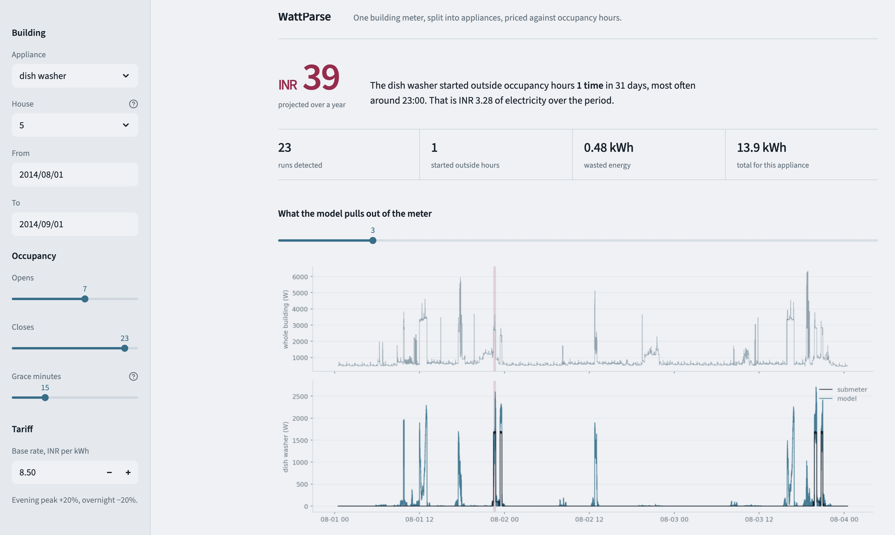
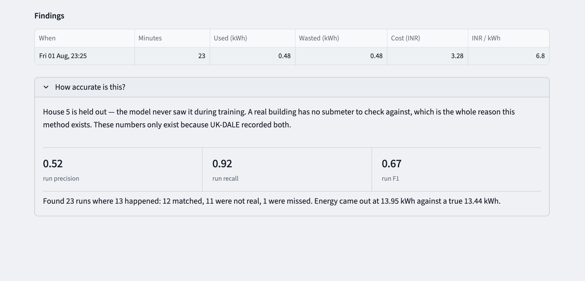
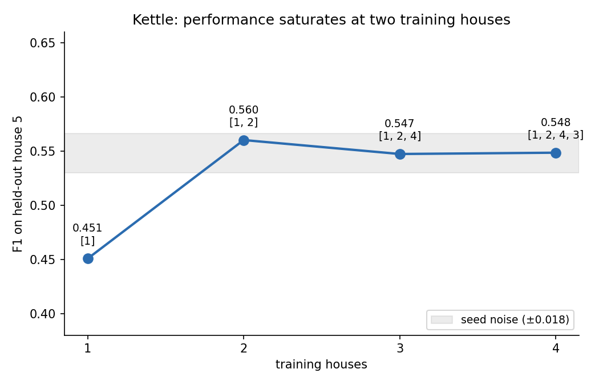

# WattParse

A building has one electricity meter. It tells you the total and nothing
else. WattParse splits that single signal into per-appliance traces, finds
equipment that ran when nobody was there, and prices it.

```bash
python -m src.run_pipeline --appliance "dish washer" --house 5
```

```
DISH WASHER - waste findings
  runs observed        23
  outside hours        1
  total energy         13.95 kWh  (INR 131.92)
  wasted energy        0.48 kWh  (INR 3.28)

  worst findings:
    2014-08-01 23:25   23 min   0.48 kWh  INR 3.28  @ 6.80/kWh
```

## The interface



The top panel is the whole-building meter — every appliance in house 5 added
together, which is the only signal a real deployment would have. The bottom
panel is what the model pulls out of it: the dishwasher's own consumption in
blue, with the true submeter reading in black for comparison. The shaded band
marks a run that started outside occupancy hours.

Occupancy hours and the tariff are adjustable in the sidebar. Changing them
re-prices the findings without re-running the model.



Each finding is one run: when it started, how long it lasted, how much energy
it used, and what that cost under a time-of-day tariff. The panel below is
the honest part — house 5 is held out, so its submeter is available to score
against. A real building has no submeter, which is the entire reason this
method exists.

```bash
streamlit run app.py
```

## Why this is hard

Sub-metering every circuit costs lakhs and needs an electrician per panel, so
the aggregate is the only signal available. But 2400 W could be a kettle and a
fridge, or an oven alone, or a heater and three lights. The total does not
decompose.

What separates appliances is shape. A kettle is a 3 kW rectangular pulse
lasting three minutes. A dishwasher runs ninety minutes across several
phases. A convolutional network can learn those shapes; a threshold cannot.

**seq2point** takes 599 consecutive mains readings — about an hour at
6-second sampling — and predicts the appliance's power at the single midpoint
sample. The midpoint gives it thirty minutes of context on either side, so
"was the kettle on at 09:15?" can be answered by seeing that power rose at
09:14 and fell at 09:17. Five 1D convolution layers, two dense, 30.5M
parameters.

## Results

Trained on UK-DALE houses 1-4, tested on house 5, which the model never saw.

| Model | MAE (W) | SAE | Precision | Recall | F1 |
|---|---|---|---|---|---|
| NILMTK CO | 214.3 | 12.80 | 0.051 | 0.976 | 0.097 |
| NILMTK FHMM | 193.8 | 11.46 | 0.061 | 0.972 | 0.114 |
| **seq2point** | **28.2** | 1.13 | 0.509 | 0.788 | **0.615 ± 0.004** |

Kettle, three seeds. seq2point beats both baselines on every metric for every
appliance tested.

Per-house random splits are not used — with sliding windows they place
near-duplicate samples on both sides and inflate results. Decision thresholds
are swept on a held-out period of a training house and applied once to the
test house.

## Two findings the accuracy number does not show

**Signal-to-noise decides whether disaggregation transfers, not appliance
power.** Across seven measurements — four appliances, two test houses — the
strongest predictor of cross-house F1 is appliance peak power divided by the
aggregate's standard deviation while that appliance is off.

| Variable | correlation with F1 |
|---|---|
| SNR × training houses | 0.893 |
| log(SNR) | 0.885 |
| SNR | 0.841 |
| training houses | 0.432 |
| event density | 0.423 |
| run duration | 0.307 |

The same microwave model scores 0.049 on house 5 and 0.478 on house 2. House
5's baseline sits at 600-1000 W and swings by thousands; house 2 is quieter.
Duration and event density, the obvious explanations, rank last.

**Two training buildings are enough.**



One building to two gains 0.109 F1. The third and fourth gain nothing — both
land inside the ±0.018 seed noise band. Variety of buildings matters; volume
of data does not. For a deployment this is the number that decides
feasibility.

Full numbers, ablations, two failed experiments, one corrected conclusion and
the known limitations — including a false positive in the demo window — are
in [RESULTS.md](RESULTS.md).

## Data

UK-DALE 2017 HDF5 (~5.5 GB) from the CEDA archive. Unzip to
`data/raw/ukdale.h5`.

The file was written in 2017 and stores its pandas type attributes as bytes,
which breaks every read under modern pandas — including `store.select`.
`src/data/load_ukdale.py` reads the PyTables nodes directly and has no NILMTK
dependency.

## Setup

```bash
python -m venv .venv && source .venv/bin/activate
pip install -r requirements.txt
pytest tests/ -v          # 14 tests, synthetic store, no download needed
```

NILMTK is deliberately not in `requirements.txt`. It needs Python 3.7 and
pandas 0.25 and will break a modern PyTorch install. It is used only for the
baselines, in a separate conda environment — on Apple Silicon it installs
only under Rosetta, via `CONDA_SUBDIR=osx-64`.

## Usage

```bash
# what each house actually recorded
python -m src.data.load_ukdale data/raw/ukdale.h5

# train one appliance
python -m src.models.train --appliance kettle --epochs 10 --keep-off-ratio 20

# score on the held-out house against the baselines
python -m src.evaluate.cross_house --appliance kettle

# full pipeline: meter to costed findings
python -m src.run_pipeline --appliance "dish washer" --house 5 --truth

# how many training buildings are needed
python -m src.experiments.house_curve --appliance kettle

# interactive
streamlit run app.py
```

Built with PyTorch (Metal/MPS), pandas, PyTables, NILMTK 0.4.3 for baselines,
matplotlib, Streamlit, pytest.